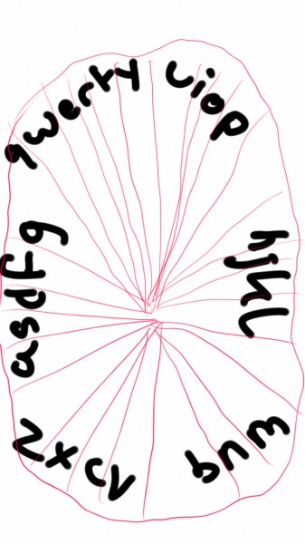
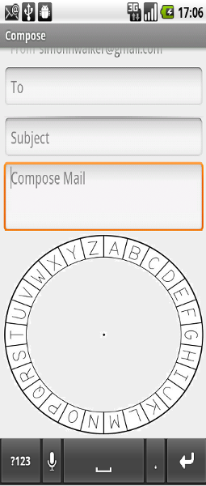

# MOTIONKEY ANDROID KEYBOARD

 
## Iteration 01

 * Start date: Thursday, February 2, 2017
 * End date: Monday, February 6, 2017

 
## Process

The team conducted a meeting to go over potential ideas that anyone may have had before finalizing our project. We are all passionate about accessibility, but we wanted to ensure that we create a product that is both meaningful to us and functional to the end user, so we conducted research on our own before the meeting on what areas of accessibility are potentially lacking in useful software and discussed this during the meeting.

 
#### Roles & responsibilities

| Role | Description | Name |
| --- | --- | --- |
| Android Developer | Responsible for developing the Android Keyboard | Mark |
| Android Developer | Responsible for developing the Android Keyboard | Fredrik |
| Android Developer | Responsible for developing the Android Keyboard | Mansoor |
| Android Developer | Responsible for developing the Android Keyboard | Tanzin |
| Android Developer | Responsible for developing the Android Keyboard | Steven |
| Android Developer | Responsible for developing the Android Keyboard | Jun |
| Meeting Leader | Prepares meeting topics and ensures everyone stays on topic | Mansoor |
| Minute Taker | Records important information discussed at the meeting | Steven |
| Android Researcher | Researchers for resources related to Android development | Mark |
| Sensor Researcher | Researchers for resources related to Android development | Fredrik |
| UI Researcher | Researchers for resources related to Android development | Tanzin |
| Issue Manager | Will allocate group resources to solving issues | Jun |

 
#### Events

We are using the software ["Slack"](https://slack.com/ "slack") to conduct daily informal meetings. We expect each member to check this software daily to update themselves on the current status of the project and to notify other team members of any issues they may be facing.

>

We are also conducting a weekly formal meeting on Mondays from 9:00 pm to 9:30 pm in order to do code reviews, to ensure that everyone is committed to the agile process and to bring everyone up to speed on what has been accomplished in the past week.

 
#### Artifacts

We are currently in the process of constructing a schedule and a task-board to precisely formalize how we will go about developing our application. We will modularize the project into well-defined parts that we can divide up amongst our team and specify a high-level schedule by which tasks should be completed. We are allowing team members to choose which part of the project they want to work on i/e. UI design, back-end coding, testing etc. We will use this schedule to identify during our weekly team meeting whether or not we are on track and whether there are any pressing issues that need to be addressed.

We are prioritizing the task of developing the software first and putting less emphasis on testing for the time being, because we haven't yet decided on function prototypes that will allow testers to follow a test-driven development approach.

 
## Product

We decided that our product should be a suite of accessibility tools that will allow people with disabilities to more effectively use android phones. Our MVP is a keyboard with keys laid out in a circle that functions with the gyroscope, thus allowing anyone who is missing fingers to type on android. Our stretch goal is to add more tools to the suite, such as a way to control the UI with voice.

 
#### Goals and tasks

- ##### Goals
	- Our goal for this iteration is for everyone to install the Android development kit, to familiarize themselves with the Android Development Environment and to inspect existing code on how a simple keyboard application works.
	- This will allow them to understand what needs to be done in order to take the idea of a keyboard and build upon it to create something new and useful to a different segment of the population.

- ##### Tasks
	- Do research on how exactly Android Development works
	- Watch video on how a simple keyboard app with no extra features works
	- Download and install Android Development Kit

- ##### Goals Ordered by Importance
	- Install Android Development Kit
	- Get familiarized with android development environment and android design principles
	- Understand how basic keyboard application works

 
#### Artifacts

 -We created rough sketches when discussing possible keyboard UI designs

 

- We will use prototyping software to construct images of how we expect the keyboard UI to look - which will
   make more tangible the current abstract and possibility differing ideas that each person may have on what the end
   product actually is.
   -This is useful for our team because this will help everyone better understand what exactly we are building.

 
        
- We will construct a short animation to show how the voice controlled UI may work, showing a person talking
   and how exactly this modifies the current state of the UI on an Android phone.
   - This too will help everyone understand how exactly the mechanism for the voice control will work and allow people to do precise research on what exactly they will need to know and need to do once we start the actual development process.
 
- Meeting notes

 	Meeting Notes - Thursday February 2nd, 2017

		Discussed Product details

		What is our minimum viable prodcut (MVP)?
			Custom keyboard UI
			Gyroscope control
			Spell checker

		What features belong to the backlog?
			Bluetooth control
			more gyroscope (tilting to scroll, etc.)
			autocomplete

		Where to start?
			Should start learning the basic of Android development
				Install Android Studio
			Work on being able to follow and understand creation of a basic custom keyboard

		Discussed process details

			What artifacts will we create?
				UI mock ups
				To do list

			What possible Git branching model will we implement?
				Divide the features into branches, one for the UI, one for the gyroscope, one for the spell checker?

		Discussed details of the deliverables

			Split the team into two groups to work on product.md and iteration-01.plan.md
			Meet near February 11th, 2017 to work on iteration-01.review.md 

 - Todo list

		TO DO:

		General:
		- Decide on Team name

		Product.md
		- Add personas
		- Diagrams and Mockups

		iteration-01.plan.md

		iteration-01.review.md
		- Review when/where
		- Process Reflection
			- Decisions that turned out well
			- did not turn out well
			- planned changes
		- Product Review
			- Goals completed
			- not completed
		- Meeting highlights
