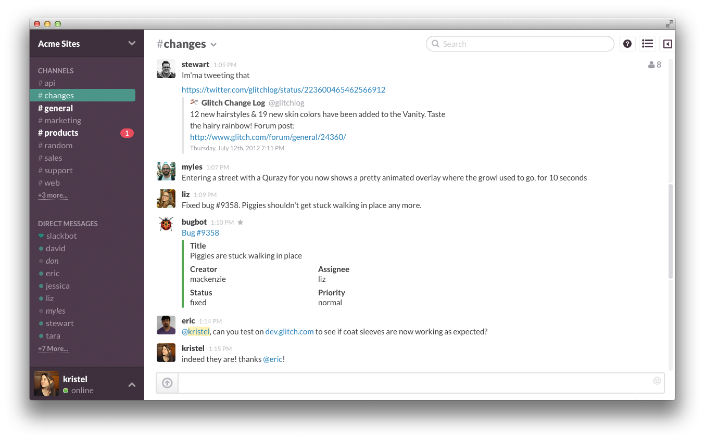

# MOTIONKEY ANDROID KEYBOARD
 
## Iteration 01 - Review & Retrospect

 * When: Feb.6.2017 - 8PM - 9:20PM (During and After Tutorial Hour)
 * Where: BA2165 & Online Via Slack

 
## Process - Reflection

As this was our last meeting before submitting the first deliverable, the main purpose of it was to finalize our product idea. During the meeting, new ideas came about that were interesting such as a programming IDE with screen reader for the blind, but ultimately the majority voted in favour of going ahead with MotionKey as it seemed like a unique project that was manageable to do.

 
#### Decisions that turned out well
 
- #####Slack - Online Team Messaging
> 
>A screenshot of a group on Slack. 
>Image courtesy of http://www.theverge.com/2014/8/12/5991005/slack-is-killing-email-yes-really
	- We decided to use an online tool called "Slack" for daily communication. This turned out to be a very successful decision because it allowed the entire group to pass information to each other. These are some of the benefits that using slack provided us with:
		- Continued discussion of possible product ideas over the weekend of February 4th, 2017
		- Ability for members to inform the group when they were unable to attend meetings
		- Sharing of meeting summaries with group members who were unable to attend the meeting

- #####More Time to Brainstorm
	- Not settling on an idea too early on gave us time to bounce more ideas off of one another and people we know outside of school. Interesting problems and insights with our product came about that led to considering changing the product altogether. Hearing different reasonings for keeping the product vs changing it led us to consider the pros and cons of the product functionality in much greater depth, such as:
		- Greater familiarity with each team-member's thinking process
		- Richer and broader ideas for potential projects
		- Knowing from the get-go what the product will be good and bad for at a greater level of depth than if little thought and discussion went into the early stages of development.

 
#### Decisions that did not turn out as well as we hoped
   
- #####Designation of Tasks
	- Although our last meeting ended with us creating roles that would be assigned to each member, designating what they are responsible for, it would have helped to have these roles early on. Meeting notes and discussions, although written by a couple of members, were not explicitly tasked to anyone. Pre-planning of the meetings would have also helped us stay on track to a greater extent.
		- Each member did not know exactly what they were responsible for or know what others were tasked with.
		- Preparedness for tutorial sessions and meetings was not optimal.
   
- #####In-Person Meetings
	- In person meetings that were scheduled apart from tutorial days were not planned as great as we liked. Although most members did show up and rest were available online through Slack, we were unable to find a good room to hold the meeting in. This led to a shorter meeting conducted in a hallway which hampered the discussion process.
		- Due to unforeseeable circumstances, group members getting sick, our in-person meetings were not as productive as they could be.
		- Needed to arrange times when most members were able to meet which was difficult to do due to each members' scheduling conflicts.

 
#### Planned changes
 
- ##### Assigning Roles to Each Member
	- In the coming weeks, we will create new roles for each team member. Examples of possible roles could be those which are more managerial in nature: Meeting Notetaker, Meeting Leader, and Meeting Scheduler. Engineering related roles would include: UI Designer, Android Developer, Sensor Specialist and Tester.

- ##### Git Branch Modeling
	- Another change we are planning on making is with regard to Git branch modeling. As of this review we have not reached a consensus as to how to model our branching. Our current thoughts are to split the initial development into three branches: UI, Gyroscope control, and Language Input Processing.

 
## Product - Review

#### Goals and/or tasks that were met/completed

- Decided on Product and Name

- Some members started learning the basics of Android Development

#### Goals and/or tasks that were planned but not met/completed

- Not everyone has installed the Android Development Kit and familiarized themselves with Android

## Meeting Highlights

Going into the next iteration, our main insights are:

- #####Learning Android development
	- As of now the group, as a whole, has very little experience with android development. In order to proceed, the the group needs to spend time learning android development.
	- Fortunately all our members have experience with Java, so we can jump in with Android development. [Google Android Training](https://developer.android.com/training/index.html "Google Android Training") is a good place to start.

- ##### Start modifying a basic android keyboard
	- Experimenting with our custom UI. Using online tutorials such as [this tutplus guide](https://code.tutsplus.com/tutorials/create-a-custom-keyboard-on-android--cms-22615 "this tutplus guide") and [this video tutorial](https://www.youtube.com/watch?v=7nsa7BuoWhU "this video tutorial")
 	We plan to get a custom keyboard up and running and branch from our basic custom keyboard which is open source code that was found on the internet.

- #####Decide on a Git Branching model
	- As previously discussed we have not reached a consensus on our git branching model. At the end of the next iteration we plan to decide and implement out a branching model that allows more productivity and ease of working with.

Rough Meeting notes

	Meeting Notes - Thursday February 2nd, 2017

	Discussed Product details

		What is our minimum viable product (MVP)?
			Custom keyboard UI
			Gyroscope control
			Spell checker

		What features belong to the backlog?
			Bluetooth control
			more gyroscope (tilting to scroll, etc.)
			autocomplete

		Where to start?
			Should start learning the basic of Android development
				Install Android Studio
			Work on being able to follow and understand creation of a basic custom keyboard

	Discussed process details

		What artifacts will we create?
			UI mock ups
			To do list

		What possible Git branching model will we implement?
			Divide the features into branches, one for the UI, one for the gyroscope, one for the spell checker?

	Discussed details of the deliverables

		Split the team into two groups to work on product.md and iteration-01.plan.md
		Meet near February 11th, 2017 to work on iteration-01.review.md

##TO DO:

	General:
	- [x]  Decide on Team name

	Product.md
	- [x] Add personas
	- [x] Diagrams and Mock-ups

	iteration-01.plan.md

	iteration-01.review.md
	- [x] Review when/where
	- [x] Process Reflection
		- [x] Decisions that turned out well
		- [x] did not turn out well
		- [x] planned changes
	- [x] Product Review
		- [x] Goals completed
		- [x] not completed
	- [x] Meeting highlights
