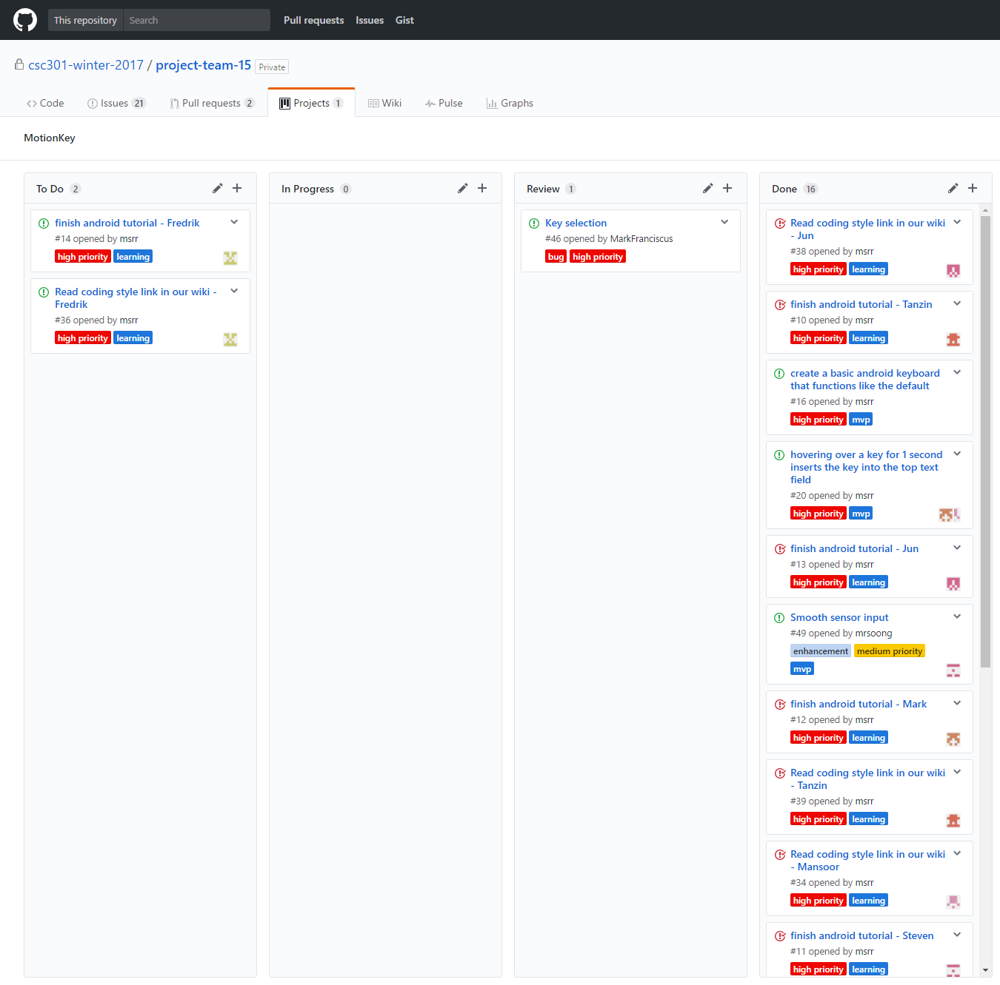
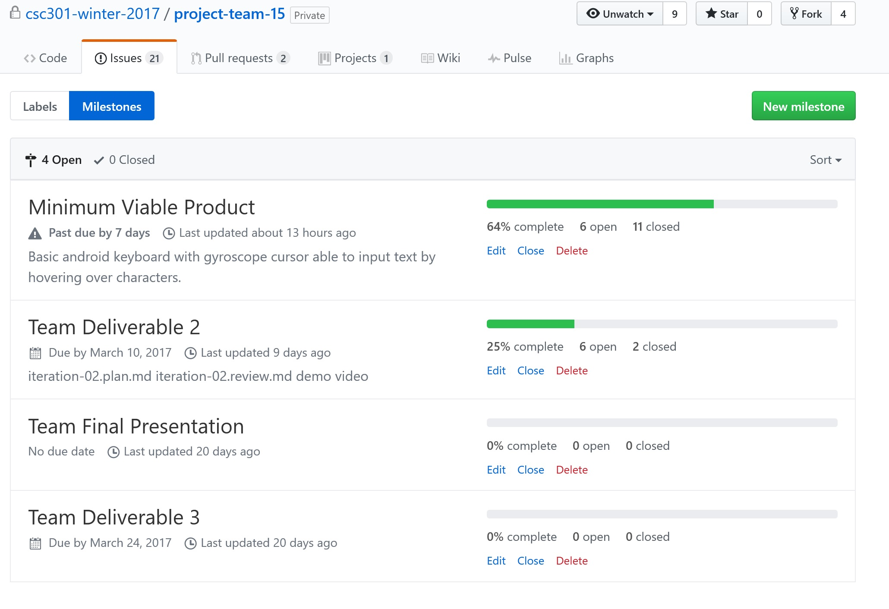

# MotionKey

## Iteration 02

 * Start date: February 14, 2017
 * End date: March 8, 2017

## Process

For this phase, we are planning on implementing our minimum viable product - we will produce a functional
motion controlled keyboard that will at the very least allow gyroscope-controlled input with no use for
any form of touch interaction. In order for us to complete this task, we anticipate that over the next
couple of weeks, all team members must familiarize themselves with the android development environment.
We spent the majority of the last iteration conceiving our product - because of this, little time was
actually spent learning the skills and researching the specific algorithms and libraries we would need
in order to actually implement the keyboard.

 
#### Roles & responsibilities

| Role | Description | Name |
| --- | --- | --- |
| Android Developer | Responsible for developing the Android Keyboard | Mark |
| Android Developer | Responsible for developing the Android Keyboard | Fredrik |
| Android Developer | Responsible for developing the Android Keyboard | Mansoor |
| Android Developer | Responsible for developing the Android Keyboard | Tanzin |
| Android Developer | Responsible for developing the Android Keyboard | Steven |
| Android Developer | Responsible for developing the Android Keyboard | Jun |
| Meeting Leader | Prepares meeting topics and ensures everyone stays on topic | Mark |
| Minute Taker | Records important information discussed at the meeting | Mansoor |
| Android Researcher | Researches resources related to Android development | Mark |
| Sensor Researcher | Researches resources related to Android development | Mansoor |
| Network Specialist  | Researches how to interface Android Phones to Windows PCs via Internet Protocols | Tanzin |
| UI Researcher | Researches resources related to Android development | Steven |
| Issue Manager | Allocates group resources to existing issues that need attention | Jun |
| Video Editor  | Edits the demo video for deliverable 2 | Mansoor |
| Lead Actor  | Plays the starring role in the video | Tanzin |
| Video Production Team  | Helped produce demo video | Mark |
| Video Production Team  | Helped produce demo video | Tanzin |
| Video Production Team  | Helped produce demo video | Mansoor |
| Video Production Team  | Helped produce demo video | Jun |
| Proof reader  | Proofreads all documents and documentation | Steven |
 

## Events

Our first meeting for this iteration occurred on February 14. We chose this particular date because it was a couple of days
before the start of reading week. This gave us ample opportunity to cover our bases, understand the requirements and
expectations from each member over the next couple of weeks as well as the specific tasks that were ahead of us in order
to implement the minimum viable product.

We anticipate that our next meeting will be on February 27, the day after reading week ends. On that day, we can reflect on what has
been completed over the past week and what still needs to be done. We expect that every team member will have at the very least gone
over the Android tutorial that one member found (and subsequently posted as a git issue for each member to complete) which explains
the basic workflow of implementing an android app. We hope to spend the next week or two after that doing an agile programming
style approach to implement the MVP itself because our time will be limited between February 27 and March 10 - the day the iteration
is actually due. 

Furthermore, we would need a functional product a couple of days before that which could be used during
the video production process. We anticipate that we will meet somewhere around March 6 and March 8 in order to actually shoot the
video. This particular rendezvous can also act as a pseudo-meeting which will allow us to reflect on what is yet to be done
before the due date of the iteration.

#### Meeting Highlights
This was our last in-person meeting before reading week. We conducted thorough discussion on all the to-do items that we
believe should be completed by this iteration. Mark printed out both the highlights from the last meeting as well as a
list of to-do items which allowed us to approach the meeting in a more formal and controller manner. We discussed what
would be our exact target user base, by what date each member must have completed the tutorial (which must be done
for each member to be a useful resource during the coding phase of the project), what would be our git branching model
(we decided to do a model that branches development from functional base product as described below), how we would make
use of git issues, how we would track member attendance, what coding style and conventions we will follow, and what are the
specifics of our minimum viable product. We decided that our product MVP is simply a bare bones keyboard that can be controlled
by motion with no extraneous features. This meeting was very productive due to every little detail having been planned beforehand,
which is something we will continue to follow going forward.

#### Artifacts

 >
 We use a kanban board to keep track of which task needs to get done. For each task, team members can create a Git issue with priority lable (i.e. high, medium or low priority), assign themselves to that Git issue and add it to the To Do column. They should move the Git issue to In Progress column when they are working on the task. Once they complete the task, they need to move it to the Review column so every team member can inspect what has changed. The Review column can also contain bug report, team members who spot a bug in the program should immediately create a Git issue with bug and high priority lables, then include an instruction to reproduce the bug. After team members approve the changes, one of the members can close the Git issue and move it to the Done Dolumn.

#### Git / GitHub workflow

Our git repository has 3 branches. Master, development, and features.

| Branch | Description |
| --- | --- |
| Master | Only that is fully tested, documented. Only the code that we're comfortable with our Professor/TA looking at. |
| Development | Code that is part of the basic MVP, or not fully tested, documented, etc. features |
| Feature ... | A single branch for each modular feature |

The process of working with the repository is 
 * Fork the group repository. 
 * Clone the fork.
 * Make commits on proper branch to the fork repository.
 * Pull request from forked repository to group repository.

A pull request cannot be merged by the person who initiated it.
In order to merge the development branch to the master it must be approved by a minimum of 3 group members, preferably by every member of Team 15.
 
For this milestone we are aiming to work on completing the MVP, as a result we will not fully utilize the feature branch.

We decided to use this workflow for multiple reasons. The master branch ensures that we meet our coding standards.
The development branch allows members to commit code that may not be fully implemented, documented, tested, but still enable other team members who may 
rely on those features to use the latest implementation. The feature branch increases modularity of our design. Modularity is very important to us. It
enables our team to work on multiple features in our backlog simultaneously while avoiding as many merge conflicts as possible.

## Product

#### Goals and tasks

 Our goal for this iteration is to produce a keyboard with gyroscope key selection via the the Android device sensor. In order to achieve this goal, we expect all team members to install Android Studio for developing the project, review the tutorials on building an Android application and Android keyboard. Team members are also expected to review all study materials such as coding style guidelines, creating custom shape keys in Android soft keyboards, detecting shakes with gyroscope and detecting when soft keyboard is opened posted on the Github Wiki. All team members are expected to show up weekly for the formal meeting on Monday from 9:00 pm to 9:30 pm, so we can discuss what has been accomplished in the previous week and what needs to get done in the current week. Lastly, all team members should continue to use the software Slack to conduct daily informal meeting about any progress they have made or challenges they are facing.
 >

#### Artifacts
 We made a demo video to better illustrate the functionality of our Android gyroscope keyboard. The video consists of two parts. The first part of the video introduces the use and target audience of the keyboard, the user can use the cursor on the screen to type characters by simply tilting the Android device to any direction to select a character and halt to type a character. The target audiences are people who lost their limbs or suffer from Carpal Tunnel Syndrome. The second part of the video shows our future plan for the Android gyroscope keyboard. We expect to make the key larger when the cursor hover over the key, a smoother feeling of the cursor, and a suite of apps that can help disables to interact with the computers. This video is useful for our team because it is a milestone of our project and it will help our target audience when we complete our future plan.
