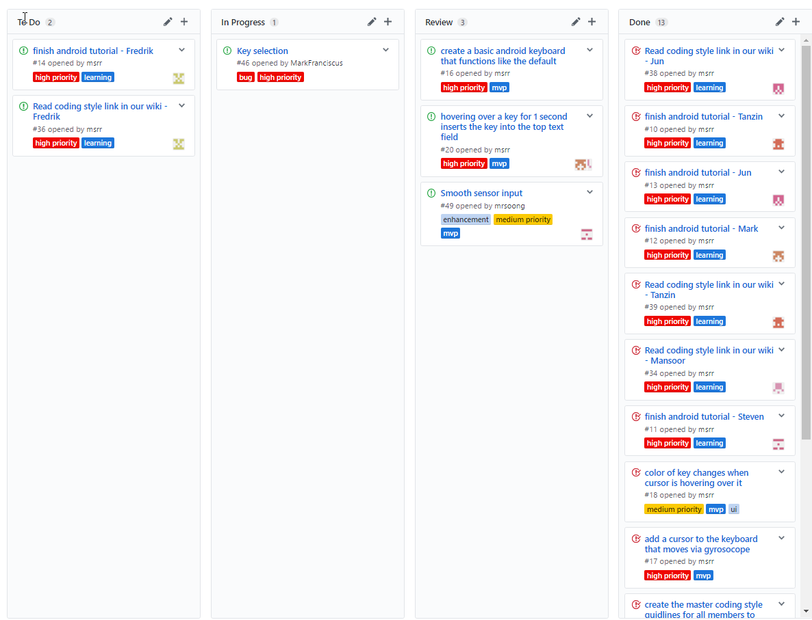

# MotionKey

## Iteration 02 - Review & Retrospect

 * When: March 8, 2017
 * Where: Bahen 4010

## Process - Reflection

In the 3 weeks between when we first conceived and finalized our product and the day this iteration is due, there were many
developments. We can concur with the assertion that Mr. Freund made early on during the semester when he said that the software
development process has many pitfalls. We had to deal with mysteriously disappearing members, software bugs that took
a large amount of research to understand and resolve and team members who varied widely in readiness to contribute to the
project due to many of them being unfamiliar with the development process. We are pleased to say, however, that our MVP is complete
and that we are currently in the process of adding the final touches to our product video and distributing back log tasks to
each member.

 
#### Decisions that turned out well

#####Self-imposed Deadline
As a group we decided early on into this iteration to set an ambitious deadline for our MVP, 
March 3rd. Our reasoning for this was to give us a week to work on the deliverable. This 
deadline had other benefits, it would give us a week's buffer of the deliverable 2 deadline. As
well as the ability to solve any problems with the MVP that came up during the buffer period.

- This turned out to be a great idea
	- We did not meet our self-imposed deadline
	- We did not panic with the deliverable
	- We had unexpected group problems, missing member, that we had to deal with.

The ambitious deadline gave us a buffered window to deal with unexpected issues.

#####Organizational Tools
Our team made use of a couple organizational tools. We make great use of a kanban board as well as
using Github built-in issue ticket system.

- This was very useful
	- Everyone in the group knows what each individual person is working on
	- Reduces the chance of two people working on the same thing

>
>

 
#### Decisions that did not turn out as well as we hoped

- ##### Online Attendance for Meetings
	- When we first finalized our team, we decided that we would have a weekly meeting which a person could potentially attend virtually. As the weeks went by, it became clear that this was not a great idea, since the level of interaction that such a person could have with the team and the team could have with that person was sorely underwhelming.
	- It created an awkard environment having to electronically inform to members who were not present in real life about what was happening during the meeting.
	- We decided to abandon this idea and instill a requirement that all team members attend meetings in-person unless they are sick and unable to attend.

- ##### Self-Responsibility Given
	- We decided before the start of reading week that the responsibility to learn Android Development would fall upon each person. It was their personal responsibility to catch up on the readings. However, this turned out to be a bad idea since different people have different work habits and different responsibilities outside of CSC301.
	- Certain members did not complete the 'required readings' until a couple of days before our self-imposed deadline to complete the MVP. In retrospect, it may have been a better idea to have a meeting during the start of this iteration where one of the Android Experts of the team would have given a lecture to the Android Novices of the team.

- ##### Handed Out Too Many Responsibilities
	- One of our team members has gone absent without leave. We anticipate he may not be contacting us going forwards. This has somewhat hampered our project, because we conceived of it in terms of what a 6 person team could do.
	- Now, having only 5 members has added some more responsibilities upon each person.

#### Planned changes

List any process-related changes you are planning to make (if there are any)
 * We are going to instill the requirement that all members attend meetings in real life from here on. This is so that all members are on the same page about what the team is working on currently and what are the pain points that need addressing. We also hope to create a cohesive team environment where people know each other and are more than just a face over a computer.
 * We are hoping to make greater use of the kanban board. Currently, it has not been used much or, to be more precise, it has not been a central part of our planning process. We believe that as we get into doing the backlog where the task distribution is more complex, we will need a precise and understandable method of tracking what exactly is being done and what isn't, which kanban is perfect for.

## Product - Review

#### Goals and/or tasks that were met/completed:
 
 * Familiarized ourselves with the Android Development Kit
    * One of our earliest goals was to learn more about Android app development, since many members of our team has had little to no experience developing practical Android applications. In order to familiarize ourselves with Android development, each member of group spent a good amount of time completing [an Android tutorial](https://developer.android.com/training/basics/firstapp/index.html "an Android tutorial"). Completing the tutorial also allowed us to become accustomed to working with Android Studio, which is the Android development environment that we will be using for this project. 
    * Our group also created a [wiki](https://github.com/csc301-winter-2017/project-team-15/wiki "wiki") containing coding style guidelines.
 * Developed a basic Android keyboard.
    * Our group had already decided that a basic custom keyboard would act as a Minimum Viable Product (MVP) for our project.
    * Over the course of the previous iteration, we were able to develop an Android keyboard that could collect data from a phone's sensors and use the data to move a cursor on the phone's screen. 
 * Decided on a Git Branching model
    * Although this particular goal was not mentioned in the last iteration plan, the pros and cons of common Git Branching models was nevertheless an issue that was often brought up during our group meetings. In the end, we decided on a Branching model where our main repository would be split into 3 branches: master, Features and Development. 
    * The master branch contains stable code that had been thoroughly tested by several members of the group. The development branch is used for developing new and critical parts of our Android, while the Features branch is used by some members of the group to develop experimental features that are not critical to our application. 

#### Goals and/or tasks that were planned but not met/completed:

 * Android keyboard still needs to be worked on
    * Even though we have been able to create a working keyboard that selects keys on the keyboard (using information gathered from sensor data), the keyboard is still somewhat buggy in its current state (e.g the sensor controlled cursor that is used to press keys stays even after the keyboard is destroyed)
    * Ultimately, we were unable to fix these bugs due to time constraints. Several members have already started working on the most severe issues, and we expect many of these bugs to be fixed over the course of the upcoming iteration.

## Meeting Highlights

Going into the next iteration, our main insights are:
* Now that all (remaining) team members are up-to-date on Android, we can effectively distribute backlog tasks to each member
* Now that we better understand each person's work habits, we will distribute tasks that we know a person can most likely complete
* We understand the pitfalls of Android development thanks to working on the MVP over the past couple of weeks and will now be able to approach the Android development workflow with more confidence and alacrity. 
* We have had over a month to understand our product, to attempt developing it, to understand each other and the strengths and weaknesses that each person brings to the table. We will now use this knowledge to attempt more of an agile style development process as we enter the last couple of weeks of the semester and we make an effort to get as many backlog tasks completed as possible.

## Demos

We made the following iterative demos to show members during the iterative development and testing

>
>
>
