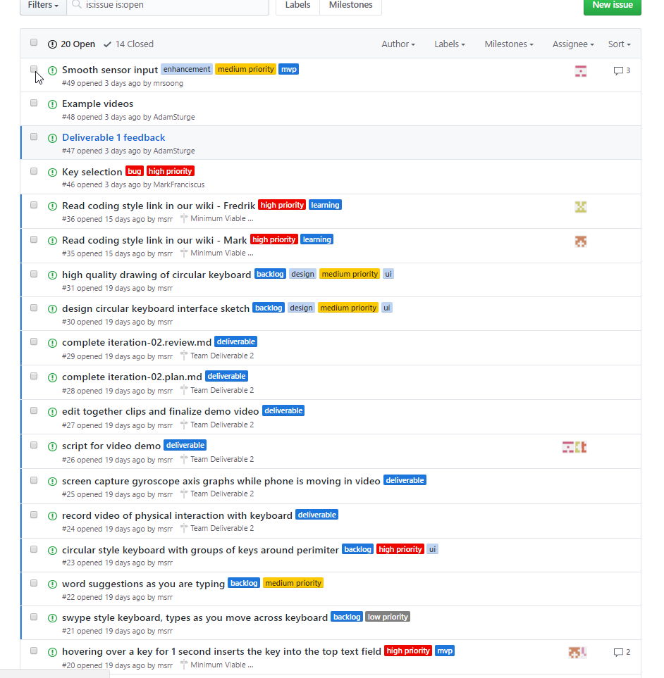

# YOUR PRODUCT/TEAM NAME

 > _Note:_ This document is meant to be written during (or shortly after) your review meeting, which should happen fairly close to the due date.      
 >      
 > _Suggestion:_ Have your review meeting a day or two before the due date. This way you will have some time to go over (and edit) this document, and all team members should have a chance to make their contribution.

## Iteration XX - Review & Retrospect

 * When: FILL IN THE DATE WHEN YOU ACTUALLY HAD YOUR REVIEW MEETING
 * Where: PHYSICAL LOCATION AND/OR ONLINE

## Process - Reflection

(Optional) Short introduction

 
#### Decisions that turned out well

#####Self-imposed Deadline
As a group we decided early on into this iteration to set an ambitious deadline for our MVP, 
March 3rd. Our reasoning for this was to give us a week to work on the deliverable. This 
deadline had other benefits, it would give us a week's buffer of the deliverable 2 deadline. As
well as the ability to solve any problems with the MVP that came up during the buffer period.

- This turned out to be a great idea
	- We did not meet our self-imposed deadline
	- We did not panic with the deliverable
	- We had unexpected group problems, missing member, that we had to deal with.

The ambitious deadline gave us a buffered window to deal with unexpected issues.

#####Organizational Tools
Our team made use of a couple organizational tools. We make great use of a kanban board as well as
using Github built-in issue ticket system.

- This was very useful
	- Everyone in the group knows what each individual person is working on
	- Reduces the chance of two people working on the same thing

>
>

 
#### Decisions that did not turn out as well as we hoped

List process-related (i.e. team organization) decisions that, in retrospect, were not as successful as you thought they would be.

 * 2 - 4 decisions.
 * Ordered from most to least important.
 * Feel free to refer/link to process artifact(s).

#### Planned changes

List any process-related changes you are planning to make (if there are any)

 * Ordered from most to least important.
 * Explain why you are making a change.
 

## Product - Review

#### Goals and/or tasks that were met/completed:
 
 * Familiarized ourselves with the Android Development Kit
    * One of our earliest goals was to learn more about Android app development, since many members of our team has had little to no experience developing practical Android applications. In order to familiarize ourselves with Android development, each member of group spent a good amount of time completing [an Android tutorial](https://developer.android.com/training/basics/firstapp/index.html "an Android tutorial"). Completing the tutorial also allowed us to become accustomed to working with Android Studio, which is the Android development environment that we will be using for this project. 
    * Our group also created a [wiki](https://github.com/csc301-winter-2017/project-team-15/wiki "wiki") containing coding style guidelines.
 * Developed a basic Android keyboard.
    * Our group had already decided that a basic custom keyboard would act as a Minimum Viable Product (MVP) for our project.
    * Over the course of the previous iteration, we were able to develop an Android keyboard that could collect data from a phone's sensors and use the data to move a cursor on the phone's screen. 
 * Decided on a Git Branching model
    * Although this particular goal was not mentioned in the last iteration plan, the pros and cons of common Git Branching models was nevertheless an issue that was often brought up during our group meetings. In the end, we decided on a Branching model where our main repository would be split into 3 branches: master, Features and Development. 
    * The master branch contains stable code that had been thoroughly tested by several members of the group. The development branch is used for developing new and critical parts of our Android, while the Features branch is used by some members of the group to develop experimental features that are not critical to our application. 

#### Goals and/or tasks that were planned but not met/completed:

 * Android keyboard still needs to be worked on
    * Even though we have been able to create a working keyboard that selects keys on the keyboard (using information gathered from sensor data), the keyboard is still somewhat buggy in its current state (e.g the sensor controlled cursor that is used to press keys stays even after the keyboard is destroyed)
    * Ultimately, we were unable to fix these bugs due to time constraints. Several members have already started working on the most severe issues, and we expect many of these bugs to be fixed over the course of the upcoming iteration.

## Meeting Highlights

Going into the next iteration, our main insights are:

 * 2 - 4 items
 * Short (no more than one short paragraph per item)
 * High-level concepts that should guide your work for the next iteration.
 * These concepts should help you decide on where to focus your efforts.
 * Can be related to product and/or process.
