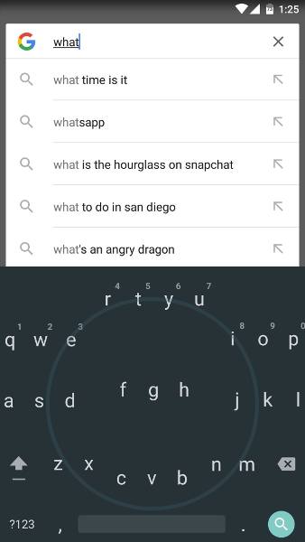

# MOTIONKEY ANDROID KEYBOARD
 
#### Q1: What are you planning to build?

Motionkey is an Android keyboard application that lets users type by tilting their phone and using motion gestures. It can be used in any phone application where the default keyboard would pop up for text input.

>  
>Two examples of the Android UI with regular keyboard replaced with Motionkey. The left UI features a QWERTY style while the right features a rotary style. 
Modified image by our team, original sources: 
https://android.gadgethacks.com/news/android-keyboard-showdown-swiftkey-vs-swype-vs-google-vs-touchpal-vs-fleksy-0169977/  
http://androidspin.com/2010/07/22/googles-secret-keyboard-hidden-in-your-keyboard/

Motionkey serves users who have trouble using a keyboard with touch input or don't simply want to use a touch-based keyboard while typing. It also serves as an alternative to text-to-speech for environments or situations where speech input isn't ideal or possible.

An example that illustrates its use as an assistive technology is as follows: Amy is a student without the use of her fingers. Currently she uses voice recognition but during meetings or class, it's not ideal. Motionkey allows Amy to type her messages with the same speed and precision as with a touch keyboard all while providing privacy and ease of use.

> 
>Tilting the phone in the direction of keyboard text to type a message. 
>Image courtesy of http://droidfreak1.blogspot.ca/2015/01/best-option-to-samsung-smart-scroll.html

#### Minimum Viable Product
Our MVP is a gyroscope-controlled keyboard that can be used by a variety of user segments, some of who may have neurological or physical conditions that hamper their ability to use the regular touch-based android keyboard. Our stretch goals are to add more accessibility features in order to create a 'suite' of tools, all of which can help various segments of the population who may have difficulty using the standard Android Interface. 
 

#### Q2: Who are your target users?

Our target users include those who are unable to use touch based input, whether it be from a disability or medical issue, and those who simply choose not to use it. Disabilities may include loss of hand digits or limbs, nerve damage, and cases where it is hard to use voice recognition as an alternative.

> 
>An Example of the Target User for this product. 
>Image courtesy of http://www.cbc.ca/news/canada/british-columbia/worksafebc-reviews-home-care-after-double-amputee-s-aid-scaled-back-1.3186595

The target group must have the ability to provide a tilting motion of some type. Some examples include placing the phone on their hand, arm, foot, or another surface that can be manipulated with tilt and gesture motions.

> 
>One method of using our product is by strapping phone to arm, which is possible even if hand is amputated. 
>Image courtesy of http://www.instructables.com/id/convert-smartphone-to-a-smartwatch-for-under-10-ea/

A detailed example using personas is provided here:

| Self Portrait | Name | Age | Personality Traits | Medical Conditions (If any) | Goals |
| --- | --- | --- | --- | :---: | --- | --- |
|| John | 19 | Social, Energetic, Open | Neuropathy | John is a college student who likes to hang out with his friends and reads books in his spare time. However, due to a condition known as neuropathy, he is unable to use his phone with a great degree of control, making it difficult for him to use applications that require text input. John wants to find an app that will make it easier for him to use applications that have been made inaccessible due to his condition. |
|| Dan | 26 | Introverted, Tech Geek | Carpal tunnel syndrome | Dan is a white collar worker who has recently been diagnosed with carpal tunnel syndrome. Since Dan is a tech enthusiast and likes to use his Android phone, he wants to find a way to enter text without putting excessive amounts of stress on his hands. |
|| George | 42 | Perceptive, Social, Judgmental | Amputee | George is an army Veteran who has lost the use of his hands. Like most of his fellow veterans, George has a difficult time adjusting to civilian life, and his friends are doing everything they can to help him re-adjust. One new piece of technology that he has been using is his Samsung Galaxy 7, and George would like to find a way to use his phone's keyboard to exchange texts with his friends. |
|| Emma | 69 | Warm, Social, Perceptive | None | Emma is a retired accountant living with her husband, and is known by her friends to be someone who is warm and very perceptive. After receiving encouragements from her daughters, Emma decided to try using various apps she found on her new smartphone. However, she has found the built-in keyboard input to be unintuitive, and would like to find an alternative input format for her phone. |

>Image Source For John's Portrait:
>https://media.licdn.com/mpr/mpr/shrink_100_100/p/6/000/23b/13c/1215447.jpg

>Image Source For Dan's Portrait:
>https://media.licdn.com/mpr/mpr/shrink_100_100/AAEAAQAAAAAAAAdtAAAAJDU1OGFiYjQyLWMyZjktNDFlNC1iYmZjLTZmYzc3ZDFkZWRhNg.jpg

>Image Source For George's Portrait:
>https://cdn0.zapnito.com/users/5255/avatar/thumb_andrew_jermy_photo_thumbnail.jpg

>Image Source For Emma's Portrait:
>https://cdn1.zapnito.com/users/11112/avatar/thumb_Sarah_Seton_Rogers.jpg

 
#### Q3: Why would your users choose your product? What are they using today to solve their problem/need?

Our product would help our target group to become more independent in their everyday use of their mobile phones. Today they might refrain from typing longer texts on their phones due to the difficulty of getting it correct.
They may also use other options, such as text-to-speech, and our product would work as complement to this. While text-to-speech is very developed and efficient today, there are many enviroments where it cannot be used. For example in public or open office spaces.

----

### Highlights

During our first meeting as a group (where every group member was present), a lot of ideas for a product were brought up and debated.  Even though we had to decide on the building an Android keyboard for our final project, the group discussion still offered important insights that helped to better understand each group members' individual skills and interests.
Through various discussions we were able to reach a consensus on the type of product that we wanted for the final project. 

All-in-all, the group members had voiced at least 3 different ideas for the product, but near the end of our meeting only two ideas were considered for the project:

1. An Android keyboard operated with the phone's built-in gyroscope
2. A calendar app for Android designed for students. The app would help the user divide up their free time to work on projects (using scheduling algorithms), and to notify the user of any assignments/projects/tests that had to be completed in the near future.

After talking amongst ourselves we decided that an Android keyboard would be a better fit for our project. Even though the calendar app would have a lot of uses in the real world, various members of the team believed that the calendar was not something that would be suitable for a 2-month long project. As building the app would only just involve building a calendar with a scheduling algorithm that can be used to manage the user's schedule, it would have been hard to justify building such an app for our project.

On the other hand, the Android keyboard operated with the phone's sensors would have more interesting (and practical) uses (e.g for disabled people can't effectively use the default keyboard found in most phones).

While discussing our options for a product, we also decided that it would be best to avoid getting too much into details early on.  As the project was still in the planning phase, we felt that the product was likely going to evolve over the course of the project. 
We therefore decided on a Minimum Viable Product (an Android keyboard controlled with a phone's gyroscope), and began thinking about various features (e.g voice recognition) that could be added once the MVP was complete.
